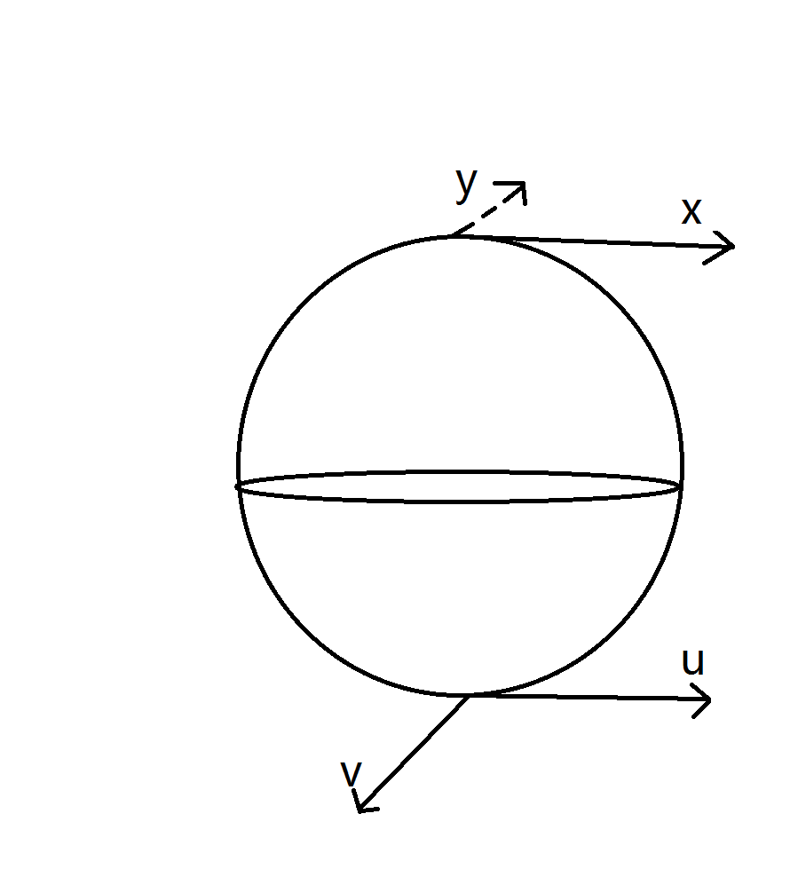

## Sheaves and bundles

### Example: Constant sheaf, not quasi-coherent; skyscraper sheaf, not quasi-coherent {#ecag-0165}

We just note the following subtlities

- the skyscraper sheaf $k$ over $\mathbb{A}_{k}^{1}=\mathrm{Spec}(k[T])$,supported at the origin, is a quasi-coherent sheaf.
- the skyscraper sheaf $k(T)$ over the affine line $\mathbb{A}_{k}^{1}=\mathrm{Spec}(k[T])$,supported at the origin, is $\mathbf{NOT}$ a quasi-coherent sheaf.
- the constant sheaf $k$ over  $\mathbb{P}_{k}^{1}=\mathrm{Proj}(k[x,y])$ is $\mathbf{NOT}$ a quasi-coherent sheaf.
- the constant sheaf $\underline{k}$ is almost never quasi-coherent.
- the constant sheaf $\underline{k}$ is always flasque. So for \v{C}ech cohomology we do have $H^{i}(\mathfrak{U}, \underline{k})=0, \forall i\geq 1$

### Remark: Sheaf cohomology, Zariski topology,  étale topology {#ecag-0166}

Note the following facts
 
- Grothendieck vanishing theorem is true for Noetherian topological spaces(in Zariski topology) and sheaves of abelian groups. 
 $$H^{2}_{Zar}(\mathbb{P}^{1},\underline{k})=0, H^{2}_{ét}(\mathbb{P}^{1}, \underline{k})\cong k.$$
- Čech cohomology also relies on the topology. For example, $\mathbb{P}^{1}=U_{0}\cap U_{1}$. If we want to compute the Čech cohomology, we have two difficulties
 
- this cover is not fine, no matter in Zariski topology or étale topology. This is not an issue, because we can use spectral sequence to compute $H^{2}(X,\underline{k})$

### Example: Locally free module v.s. locally free sheaf; why we need Noetherian condition {#ecag-0167}

Here we have an example of a locally free module but not locally free as a sheaf over the corresponding scheme.  What we really need is the following 

- $\mathscr{F}=\widetilde{M}$ is locally free as a sheaf if and only if $M$ is projective.
- A finitely generated module $M$ over a noetherian ring is projective if and only if it's locally free as a module.

### Remark: Coherent sheaf $\Leftrightarrow $ finitely generated module, Hartshorne $\mathrm{II}.5.5$ {#ecag-0168}

What matters is the `finite generation of the kernel'.

### Example: A finitely generated flat module but not finitely presented, not flat {#ecag-0169}

Let $R=\Pi_{i=1}^{\infty}\mathbb{F}_{2}$.

### Example: Locally free module but not projective {#ecag-0170}

Consider $$R=\mathbb{Z}, M=\mathbb{Z}[\dots, \frac{1}{p}, \dots]$$

### Example: A (smooth) vector bundle but not a (holomorphic, algebraic) vector bundle, Shizhang \& Zijun {#ecag-0171}

Consider $$X=\mathbb{P}^{1}\times \mathbb{P}^{1}\setminus\Delta\rightarrow \mathbb{P}^{1},$$
$$(x,y)\mapsto x,$$
where $\Delta$ is the diagonal. Then

- $X$ is a topological vector bundle and isomorphic to (topologists') $\mathcal{O}_{\mathbb{P}^{1}}(-2).$
- $X$ is not a holomorphic, not an algebraic line bundle, it's not the total space of (geometers') $\mathcal{O}_{\mathbb{P}^{1}}(-2).$
- $X$ is diffeomorphic to the holomorphic bundle $\mathcal{O}_{\mathbb{P}^{1}}(-2)$ and also diffeomorphic to $\mathrm{Tot}(\mathcal{O}_{\mathbb{P}^{1}}(-2))^{an}.$

The first statement comes from we have an Segre embedding 
$$s:\mathbb{P}^{1}\times \mathbb{P}^{1}\setminus \Delta\rightarrow \mathbb{P}^{3},$$
$$([x,y],[z,w])\mapsto [xz,xw, yz, yw].$$
Denote the coordinates on $\mathbb{P}^{3}$ be $[X,Y,Z,W]$, then the image a closed subvariety in the complement of the hyperplane $V(Y-Z)$, thus affine. Then we know no section $\sigma: \mathbb{P}^{1}\rightarrow X$ exists! $X$ is not a vector bundle in the world of algebraic geometry, it's just an affine variety, has a morphism to $\mathbb{P}^{1}$, every fibre over a closed point is isomorphic to $\mathbb{A}^{1}$, that's it. However, in a topologist's eyes, the picture is different. Let's work over $\mathbb{C}$. We do have a section(this section is not algebraic, not holomorphic)
$$\sigma:\mathbb{P}_{\mathbb{C}}^{1}\cong S^{2}\rightarrow S^{2}\times S^{2}\setminus \Delta,$$
$$x\mapsto (x,-x).$$
\begin{figure}[h!]
\centering

\caption{An orientation of $S^{2}$}
$}
\end{figure}

Now we have to prove it's topologists' $\mathcal{O}(-2)$.  We first have to talk about `an orientation on $S^{2}$', for me, this means: 
$$\text{find charts in a compatible way, i.e $\mathrm{det}J>0.$}$$
For $S^{2}$, we have spherical projections and it has a natural complex structure, then $z=x+iy, w=u+iv$ gives us a natural orientation 
$$(U_{0}, (x,y)), (U_{1}, (u,v)); u=\frac{x}{x^{2}+y^{2}}, v=\frac{-y}{x^{2}+y^{2}}.$$
We can define a deformation of the antipodal section $\segma$
$$\sigma_{t}: S^{2}\rightarrow S^{2}\times S^{2}\setminus\Delta,$$
$$x \mapsto (x, \rho_{t}(-x)),$$
where $\rho_{t}$ is the rotation w.r.t to the line connecting the north($N$) and south($S$) poles by an angle $t$ (later, it'll be clear the flow or deformation we choose is not important, it's doesn't matter it's orientation preserving or not, the intersection number of two sections are important). To do computations, we have to work in the $(x,y,u,v)$ coordinate system. Near the north pole of the source two sections are given by 
$$\sigma:x=x, y=y, u=-x, v=y,$$
$$\sigma_{t}: x=x, y=y, u=(-x)cos(t)+ysint(t), v=(-x)(-sin(t))+ycos(t).$$
$$\sigma\cap \sigma_{t}=\{p=(N,S), q=(S,N)\}\subset S^{2}\times S^{2}.$$
We only need to compute the index of the intersection. It's given by the sign of 
$$A=\begin{pmatrix}\frac{\partial \sigma}{\partial x}\\
\frac{\partial \sigma}{\partial y}\\
\frac{\partial \sigma_{t}}{\partial x}\\
\frac{\partial \sigma_{t}}{\partial y}\end{pmatrix}=\begin{pmatrix}1 & 0 & -1 & 0\\
0 & 1 & 0 & 1\\
1 & 0 & -cos(t) & sin(t)\\
0 & 1 & sint(t) & cos(t)\end{pmatrix}.$$
$$\mathrm{det}(A)=-2+sin(2t).$$
Since $t$ is small, this is negative, the index is $-1$! Same computation for the other intersection point $q$. Thus we get the degree of the bundle is $-2$. All our claims are clear now.

### Remark {#ecag-0172}

Think about the definition of the section 
$$\sigma:x=x, y=y, u=-x, v=y,$$
actually, it's more clear if we write it as 
$$\sigma:x=x', y=y', u=-x', v=y',$$
where $(x',y')$ is the coordinates in the source around the north pole $N$, $(x,y, u,v)$ is the coordinates in the target around the point $(N,S)$. We can also use de Rham cohomology to compute everything, maybe we want to leave it as an exercise to the readers who have plenty of free time....

### Remark: index, degree {#ecag-0173}

Compare the following concepts

- The index of a fixed point of an automorphism $f: X\rightarrow X$.
$$i(p):=1; \mathrm{det}(1-f_{*}|_{T_{p}X}).$$
- Lefschtz index of $f: X\rightarrow X$ 
$$\Lambda(f)=\sum_{k}(-1)^{k}\mathrm{Tr}(f^{*}: H^{k}(X)\rightarrow H^{k}(X)).$$
Actually, we have $\Lambda(f)=\sum_{p\in \mathrm{Fix}}i(p).$
- index of a vector field. Poincaré–Hopf theorem for compact manifold.
- index of the intersection of two maps $f: X\rightarrow Y$, $g: Z\rightarrow Y.$
- degree of a map $f: X\rightarrow Y$(in differential topology) v.s degree of a morphism $f: X\rightarrow Y$ (in algebraic geometry).
- degree of `the' top Chern class.
- intersection index.
- intersection number(in differential topology) v.s. intersection number (in algebraic geometry).
As far as I can see, for those concepts in topology, we only need to remember the definition of the intersection index of two smooth maps. For example, the degree of a smooth map $f: X\rightarrow Y$ is actually the intersection index of cycles $[X\times y]$ and $[\Gamma]=[(x, f(x))]$ in $X\times Y.$ More specially, $[\Delta][\Gamma]$ gives us $\sum_{p\in \mathrm{Fix}}i(p).$

### Example: a reflexive sheaf but not locally free {#ecag-0174}

$$[\text{reflexive sheaf](https://math.stackexchange.com/questions/1879866/double-dual-of-torsion-free-sheaves-are-locally-free)}$$

### Example: a coherent sheaf but not a quotient of locally free sheaf {#ecag-0175}

Consider $X=\overline{\mathbb{A}^{n}}$, the affine plane with double origins, $n\geq 2$. Then any locally free sheaf on $X$ is trivial. Because we know any locally free sheaf on $\mathbb{A}^{n}$ is free(Quillen-Suslin Theorem), to get a locally free sheaf on $X$, we need to glue two copies of locally free sheaf on $\mathbb{A}^{n}$ along $\mathbb{A}^{n}\setminus\{0\}$. $\Gamma(A^{n}\setminus\{0\})=\Gamma(\mathbb{A}^{n})$, thus this isomorphism extends to $\mathbb{A}^{n}$, which means we can only glue two isomorphic free sheaves. Then `any coherent sheaf on $X$ is a quotient of locally free sheaves' is equivalent of saying that `every coherent sheaf on $X$ is globally generated', by a proposition in Hartshorne, this is equivalent of saying $\mathcal{O}_{X}$ is ample $\Rightarrow H^{i}(X,\mathscr{F})=0, \forall i\geq 1$, apply Serre's criterion of affiness, this tells us $X$ is affine, which is absurd.  Let's  denote the two copies of $\mathbb{A}^{n}$ by $U_{0},U_{1}$, two origins $p,q$, consider the ideal sheaf $\mathscr{I}$ of $p$,
$$U_{0}:(x_{1}, \dots, x_{n})$$
$$U_{1}: k[y_{1},\dots, y_{n}]$$
$$U_{0}\cong U_{1}: x_{i}\rightarrow y_{i}.$$
Then $1\in \mathscr{L}_{q}$. But any global section of $\mathscr{L}$ must be of the form $\{(f,f)|f(0)=0\}$, thus $\mathscr{I}$ is not globally generated.

### Remark {#ecag-0176}

More discussions about this fact can be found [here](https://math.stackexchange.com/questions/849958/is-there-a-coherent-sheaf-which-is-not-a-quotient-of-locally-free-sheaf). We do have 

- on a quasi-projective variety, any coherent sheaf is a quotient of a locally free sheaf.

%%%%%%%%%%%%%%%%%%%%%%%%%

### Example: A universally closed morphism but not a closed embedding {#ecag-0177}

We have tons of example. Say 
$$\mathbf{P}_{k}^{1}\rightarrow \mathbf{P}_{k}^{1}; z\mapsto z^{n}.$$ Or something like
$$\mathrm{Spec}(k[t]) \rightarrow\mathrm{Spec}(k[t^{2},t^{3}]).$$

### Example: constant fibre $\neq$ locally free {#ecag-0178}

This example is silly, just consider the identity map
$$\mathrm{id}: X=\mathrm{Spec}(k[t]/(t^{2}))\rightarrow k[t]/(t^{2})=X$$
and the sheaf(actually module) $F=k[t]/(t)$ over $k[t]/(t^{2})$, $y=(t)$ is the unique point in $X$. Then we have 
$$\dim_{k(y)}H^{0}(X,F)=\dim_{k}k[t]/(t)=1$$
which is a constant. But $k[t]/(t)$ is not a free $k[t]/(t^{2})$-module. You moght argue it's because $k[t]/(t)$ is not a flat $k[t]/(t^{2})$-module(it's interesting to have fun with different criteria of flatness in this over simplified example).
