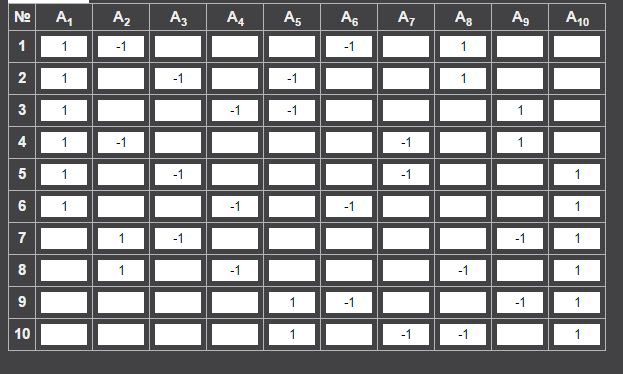
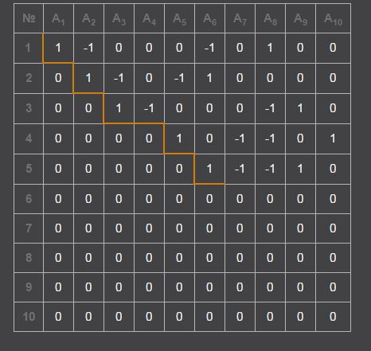

## Chow rings

### Example: Chow ring of $\overline{\mathrm{M}}_{0,n}$ {#ecag-0233}

Let's start with $\overline{\mathrm{M}}_{0,4}\cong \mathbb{P}^{1}$, then we have $\delta_{1,2}=\delta_{1,3}=\delta_{1,4}$, and $\delta_{1,2}\delta_{1,3}=0$. We get the Chow ring 

$$\mathrm{CH}^{*}(\mathbb{P}^{1})\cong \mathbb{Z}[\delta]/(\delta^{2}).$$

How about $\overline{\mathrm{M}}_{0,5}$? We have $\binom{5}{2}=10$ generators $\delta_{i,j}$ with the relations

- For distinct i,j,k,l

$$\delta_{i,j}+\delta_{k,l}=\delta_{i,k}+\delta_{j,l}=\delta_{i,l}+\delta_{j,k}$$

- multiply the equations above by $\delta_{i,j}$, and apply the third relation in Keel's description, we get double products 

$$\delta_{i,j}^{2}=\delta_{k,l}^{2}=-\delta_{a,b}\delta_{c,d}$$

- all triple products and above vanish by dimensional argument.
where $a,b,c,d$ are any $4$ distinct elements in $\{1,2,3,4,5\}$.

Well, what is this ring exactly? Let's do more trivial computations, if we label $\{\delta_{1,2},\delta_{1,3},\dots ,\delta_{2,3},\dots , \delta_{4,5}\}$ lexicographically as $\{e_{1},\dots, e_{10}\}$, the only complicated part of $\mathrm{CH}^{*}(\overline{\mathrm{M}}_{0,5})$ is the $\mathrm{Pic}(\overline{\mathrm{M}}_{0,5})$, use the first relation above, it's given by the cokernel of the matrix in the first figure below.
\begin{figure}[h!]
\centering

\caption{Linear relations among $\delta_{i,j}$}

\end{figure}
Carry out the standard elimination algorithm, we get the matrix in the second figure below,
\begin{figure}[h!]
\centering

\caption{Linear relations among $\delta_{i,j}$}

\end{figure}
this tells us that 

$$\mathrm{rank}(\mathrm{Pic})(\overline{M}_{0,5})=5$$

To be more precise, we have 

$$\delta_{1,2}=\delta_{1,3}+\delta_{2,4}-\delta_{3,4}$$

$$\delta_{1,3}=\delta_{1,4}+\delta_{2,3}-\delta_{2,4}$$

$$\delta_{1,4}=\delta_{1,5}+\delta_{3,4}-\delta_{3,5}$$

$$\delta_{2,3}=\delta_{2,5}+\delta_{3,4}-\delta_{4,5}$$

$$\delta_{2,4}=\delta_{2,5}+\delta_{3,4}-\delta_{3,5}$$

$$\delta_{1,5}, \delta_{2,5},\delta_{3,4},\delta_{3,5},\delta_{4,5}\text{ are free generators}$$

These computations tell us, Keel's description of $\mathrm{CH}^{*}(\overline{M}_{0,n})$ is not necessarily an easy and clean one. On the other hand, we can give a more geometric description of the computation of $\mathrm{CH}^{*}(\overline{\mathrm{M}}_{0,5})$ here by realizing $\mathrm{CH}^{*}(\overline{\mathrm{M}}_{0,5})$ as a blow-up of $\mathbb{P}^{1}\times \mathbb{P}^{1}$ along $3$ distinct points on the diagonal. That is the universal curve diagram 

<!-- tikzcd diagram: manual conversion needed -->
```latex
<!-- tikzcd diagram: manual conversion needed -->
```latex
\begin{tikzcd}
\mathscr{U}_{g,n+1}\arrow{rr}{\text{contraction}}\arrow{d}{\pi_{n+1}}& & \mathscr{U}_{g,n}\times_{\overline{\mathrm{M}}_{g,n}}\mathscr{U}_{g,n}\arrow{r}\arrow{d} & \mathscr{U}_{g,n}\arrow{d}{\pi_{n}}\\
\overline{\mathrm{M}}_{g,n+1}\arrow{rr}{\cong}& &\mathscr{U}_{g,n}\arrow{r}{\pi_{n}} & \overline{\mathrm{M}}_{g,n}
\end{tikzcd}
```
```
specializes to 
<!-- tikzcd diagram: manual conversion needed -->
```latex
<!-- tikzcd diagram: manual conversion needed -->
```latex
\begin{tikzcd}
\overline{\mathrm{M}}_{0,5}\cong Bl_{(0,0),(1,1),(\infty, \infty)}(\mathbb{P}^{1}\times \mathbb{P}^{1})\arrow{rr}{\text{contraction}}\arrow{d}{\pi_{4}}& & \mathbb{P}^{1}\times \mathbb{P}^{1}\arrow{r}\arrow{d} & \mathbb{P}^{1}\arrow{d}{\pi_{3}}\\
\overline{\mathrm{M}}_{0,4}\arrow{rr}{\cong}& &\mathbb{P}^{1}\arrow{r}{\pi_{3}} & \overline{\mathrm{M}}_{0,3}\cong pt
\end{tikzcd}
```
```
The blow-up of $\mathbb{P}^{2}$ at two points is isomorphic to the blow-up of $\mathbb{P}^{1}\times \mathbb{P}^{1}$ at one point. To see this,  think about the geometry here $Bl_{2pts}(\mathbb{P}^{2})$ contains three $(-1)$-divisors, namely, $E_{1}, E_{2}$ and $H-E_{1}-E_{2}$(the strict transformation of the line passing the two points). If we blow down the divisor $H-E_{1}-E_{2}$, Consider the ample divisor $2H-E_{1}-E_{2}$, this corresponding to conics passing the two points, we get a degree $2$ smooth surface in $\mathbb{P}^{3}$, 
over an algebraically closed field, it's isomorphic to $\mathbb{P}^{1}\times \mathbb{P}^{1}$ which just contracts the strict transformation of the line passing through the two points. Then we know $\overline{\mathrm{M}}_{0,5}\cong Bl_{4pts}(\mathbb{P}^{2})$, the Chow ring structure is given by 

$$\mathrm{CH}^{*}(\overline{\mathrm{M}}_{0,5})\cong \mathbb{Z}[H, E_{1},E_{2}, E_{3}, E_{4}]/(H^{2}-1, HE_{i}, E_{i}^{2}+1, E_{i}E_{j}).$$

Finally, we want to ask, what are those $\delta_{i,j}$'s in this ring?

### Remark: Keel, Chow ring of $\overline{\mathrm{M}}_{0,n}$ {#ecag-0234}

Sean Keel computed $\mathrm{CH}^{*}(\overline{\mathrm{M}}_{0,n})$ in the paper [Intersection theory of moduli space of stable $n$-pointed curves of genus $0$](http://www.math.colostate.edu/~renzo/teaching/Topics10/keel.pdf). Which says that $\mathrm{CH}^{*}(\overline{\mathrm{M}}_{0,n})$ is generated by boundary divisors $\{\delta_{S}|S\subset \{1,2,\dots, n\}, \#S \geq2, \# S^{c}\geq2\}$ subject to the following relations

- $\delta_{S}=\delta_{S^{c}}$.
- For any distinct $i,j,k,l\in \{1,2,\dots, n\}$ 

$$\sum_{i,j\in S, k,l\in S^{c}}\delta_{s}=\sum_{i,k\in S, k,l\in S^{c}}\delta_{s}=\sum_{i,l\in S, j,k\in S^{c}}\delta_{s}$$

- $\delta_{S}\delta_{T}=0$ unless $S\subset T, S\subset T^{c}, S^{c}\subset T, S^{c}\subset T^{c}$.

### Remark: Blow-ups of $\mathbb{P}^{2}$ {#ecag-0235}

Here, we have to be a little bit careful. We know $Bl_{2pts}(\mathbb{P}^{2})$ is isomorphic to $Bl_{pt}(\mathbb{P}^{1}\times \mathbb{P}^{1})$, but note that $\mathbb{F}_{1}\cong Bl_{pt}(\mathbb{P}^{2})\ncong \mathbb{P}^{1}\times \mathbb{P}^{1}$ because on $\mathbb{P}^{1}\times \mathbb{P}^{1}$ we don't have any $(-1)$-curve! This fact also tells us that $\mathbb{F}_{1}:=\mathbb{P}(\mathcal{O}\oplus\mathcal{O}(1))$ is not minimal, all other $\mathbb{F}_{n}$'s are minimal! To conclude,

- $Bl_{\text{$3$ distinct points on $\Delta$}}(\mathbb{P}^{1}\times \mathbb{P}^{1})\cong Bl_{\text{$4$ general points }}(\mathbb{P}^{2})$
- $Bl_{\text{$3$ general points}}(\mathbb{P}^{1}\times \mathbb{P}^{1})\cong Bl_{\text{$3$ distinct points on $\Delta$}}(\mathbb{P}^{1}\times \mathbb{P}^{1})$
- $Bl_{\text{$4$ general points }}(\mathbb{P}^{2})\ncong Bl_{\text{4pts, 3 on a line}}(\mathbb{P}^{2})$
- If we blow-up three  points on a line $L$ in $\mathbb{P}^{2}$, the total transformation $L'$ of the $L$ is in the class $H-E_{1}-E_{2}-E_{3}$, thus $L'^{2}=-2$, thus we get a $(-2)$-curve, the ordinary blow-up doesn't have any $(-2)$-curve.

<!-- %%%%%%%%%%%%%%%%%%%%%%%%%%%%%%%%%%%% -->
## Five conics problems via fundamental class
Excess intersection theory or intersection theory on the space of complete conics (i.e Blow up of the degree $2$ Veronese surface in $\mathbf{P}(\mathrm{H}^{0}(\mathcal{O}_{\mathbf{P}^{2}}(2)))\cong \mathbf{P}^{5}$) shows that $3264$ smooth conics tangent to $5$ generic conics. Here we want to interpret the the computations in excess intersection theory in term of the construction of the fundamental class of a moduli problem. We know the locus of conics that are tangent to a given conic is a degree $6$ hypersurface in $\mathbf{P}^{5}$. We have to consider the intersection $\mathcal{M}=\bigcap_{i=1}^{5}Z_{i}$ degree $6$ hypersurfaces of this form, each with defining equation $f_{i}$. We view them as sections of $\mathcal{O}_{\mathbf{P}^{5}}(6)$. The universal property of $\mathcal{M}$ comes from the fact that it's a fibre product. $\mathcal{M}$ is not a complete intersection, the construction of the fundamental class in this case is just that we scaling the images all those global sections $f_{i}\rightarrow tf_{i}$. When $t\rightarrow +\infty$, we end up with the normal cone $C_{\mathcal{M}/\mathbf{P}^{5}}$ of $\mathcal{M}$ in $\mathbf{P}^{5}$, which lives in $E:=\bigoplus_{i=1}^{5}\mathcal{O}_{\mathbf{P}^{5}}(6)$, and the support of it is just $\mathcal{M}$.  Although the cone is not a global section of $E|_{\mathcal{M}}$. The principle of fundamental classes is just that we view it as a global section. Then $[\mathcal{M}]^{\vir}$ is defined to be $[C_{\mathcal{M}}/\mathbf{P}^{5}|_{\mathcal{M}}]\cap \mathcal{M}$, this intersection is well-defined because we have the Gysin isomorphism $0^{!}: A_{k}(E)\rightarrow A_{k-\mathrm{rk}{E}}(\mathcal{M})$. In other words, we're in the following situation.
<!-- tikzcd diagram: manual conversion needed -->
```latex
<!-- tikzcd diagram: manual conversion needed -->
```latex
\begin{tikzcd}
C_{\mathcal{M}/\mathbf{P}^{5}}|_{\mathcal{M}}\arrow{r}\arrow{d} & E=\mathcal{O}^{\oplus 5}_{\mathbf{P}^{5}}(6)\arrow{d}\\
\mathcal{M}\arrow{r} &\mathbf{P}^{5}
\end{tikzcd}
```
```
The computation of $[\mathcal{M}]^{\vir}$ boils down to the computation of the Gysin map. To do it, we have
<!-- tikzcd diagram: manual conversion needed -->
```latex
<!-- tikzcd diagram: manual conversion needed -->
```latex
\begin{tikzcd}
\mathcal{M}\arrow[d, equal]\arrow{r}{\text{c.l}} & C_{\mathcal{M}}/\mathbf{P}^{5}|_{\mathcal{M}}\arrow{d}{\text{c.l}}\\
\mathcal{M} \arrow{r}{\text{c.l}} & E|_{\mathcal{M}}
\end{tikzcd}
```
```
Where `c.l' stands for closed embedding. In this situation, we have (see for example Ravi Vakil's notes [here](http://math.stanford.edu/~vakil/245/245class16.pdf)) 

$$[C_{\mathcal{M}/\mathbf{P}^{5}}|_{\mathcal{M}}]\cap [\mathcal{M}]=\{c(E|_{\mathcal{M}})s(\mathcal{M}, C_{\mathcal{M}/\mathbf{P}^{5}}|_{\mathcal{M}})\}_{0}.$$

The normal cone is just the normal bundle, but one subtle thing here is that although set-theoretically the $2$ dimensional component $T$ of $\mathcal{M}$ is just the degree $2$ Veronese surface $S$, scheme-theoretically, it's not. The multiplicity of $Z_{i}$ along $S$ is $2$ (see for example Eisenbud's book [here](https://scholar.harvard.edu/files/joeharris/files/000-final-3264.pdf), p463). Then we know the degree $k$ piece of the segre class $s(\mathcal{M}, C_{\mathcal{M}/\mathbf{P}^{5}}|_{\mathcal{M}})$ is given by 

$$s_{k}(\mathcal{M}, C_{\mathcal{M}/\mathbf{P}^{5}}|_{\mathcal{M}})=2^{k+3}s(S, N_{S/\mathbf{P}^{5}})+s_{k}(\text{zero dimensional components of $\mathcal{M}$}).$$

Now we compute 

$$c(E|_{\mathcal{M}})=(1+6H)^{5}|_{\mathcal{M}}=(1+12h)^{5}.$$

$$c(N_{S/\mathbf{P}^{5}})=\frac{(1+H)^{6}|_{S}}{(1+h)^{3}}=1+9h+30h^{2}.$$

Which implies

$$s(S, N_{S/\mathbf{P}^{5}})=1-9h+51h^{2}.$$

Thus

$$s_{k}(\mathcal{M}, C_{\mathcal{M}/\mathbf{P}^{5}}|_{\mathcal{M}})=8-144h+1632h^{2}+s_{k}(\text{zero dimensional components of $\mathcal{M}$}).$$

Finally, we get 

$$[\mathcal{M}]^{\vir}=\deg((1+12h)^{5}(8-144h+1632h^{2}))+\text{zero dimensional components of $\mathcal{M}$}$$

$$=4512[\text{pt on $T$}]+\text{zero dimensional components of $\mathcal{M}$}.$$

Now use the fact that

$$i_{*}[\mathcal{M}]^{\vir}=c_{\mathrm{top}}(E)=7776[\text{pt on $\mathbf{P}^{5}$}]$$

We get 

$$\text{number of zero dimensional components of $\mathcal{M}$}=7776-4512=3264.$$

However, from the point of view of fundamental classes, the important thing is not the solution $3264$ of the five conics problem, it's the fact that $[\mathcal{M}]^{\vir}$ is given by $4512$ points on the non-reduced Veronese surface plus all zero dimensional components of $\mathcal{M}$.
## Quantum cohomology of projective spaces We apply basic Schubert calculus to prove that 

$$QH^{*}(\mathbf{P}^{n}, \mathbf{Z})=\mathbf{Z}[h_{1},q]/(h_{1}^{n+1}-q).$$

The most annoying part is the notation, we use the following

$$
\begin{tabular}{ |p{3cm}||p{3cm}|p{3cm}|p{3cm}|  }
 \hline
 \multicolumn{4}{|c|}{$\mathbf{P}^{n}$} \\
 \hline
 \text{Algebraic cycles}& $\mathrm{H}_{*}(\mathbf{P}^{n}, \mathbf{Z})$ & $\mathrm{H}^{*}(\mathbf{P}^{n},\mathbf{Z})$ &\text{Differential forms}\\
 \hline
 \text{[pt]}  & $\mathrm{H}_{0}, H^{n}$    & $\mathrm{H}^{0}, h_{0}$ &  \text{constant functions}\\
 \hline
  \text{[$\mathbf{P}^{1}$]}  & $\mathrm{H}_{2}, H^{n-1}$    & $\mathrm{H}^{2}, h_{1}$ &  \text{$(1,1)$-forms}\\
 \hline
 ...&...&...&...\\
 \hline
   \text{[$\mathbf{P}^{n}$]}  & $\mathrm{H}_{2n}, H^{0}$    & $\mathrm{H}^{2n}, h_{n}$ &  \text{$(n,n)$-forms}\\
 \hline
\end{tabular}

$$
Two extra terms for the computation

$$\mathrm{H}_{2}(\mathbf{P}^{n}, \mathbf{Z})=\mathbf{Z} H^{n-1}, q^{rH^{n-1}}\leftrightarrow q^{r}$$

$$\dim \mathcal{M}_{0,3}(\mathbf{P}^{n}, rH^{n-1})=(\dim \mathbf{P}^{n}-3)(1-0)+3+\int_{rH^{n-1}}T_{\mathbf{P}^{n}}=n+r(n+1).$$

The quantum product is defined to be 

$$h_{i}\circ h_{j}:=\sum (h_{i}\circ h_{j})_{rH^{n-1}}q^{r}$$

$$=\sum\langle H^{i}|H^{j}|H^{k}\rangle_{rH^{n-1}}h_{k}q^{r}.$$

Since $\ev_{1}^{*}(H^{i})\cup \ev_{2}^{*}(H^{j})\cup \ev^{*}_{3}(H^{k})$ cuts down the dimension of $\mathcal{M}_{0,3}(\mathbf{P}^{n}, rH^{n-1})$ by at most $3n$. Thus $\langle H^{i}|H^{j}|H^{k}\rangle_{rH^{n-1}}\neq 0$ only if $r=0$ or $1$. First we have the classical intersection part 
$$\langle H^{i}|H^{j}|H^{k}\rangle_{0}=\begin{cases}1 & i+j+k=n\\
0 & \text{otherwise}.\end{cases}$$
To compute $\langle H^{i}|H^{j}|H^{k}\rangle_{1H^{n-1}}$, we use basic Schubert calculus. The geometric meaning of  $\langle H^{i}|H^{j}|H^{k}\rangle_{1H^{n-1}}$ is that projective lines intersecting with $H^{i}, H^{j}$ and $H^{k}$. In other words, it means $2$-planes in $\mathbf{C}^{n+1}$ intersecting $(n+1-i)$-plane, $(n+1-j)$-plane and $(n+1-k)$-plane nontrivially. In $\operatorname{Gr}(2, n+1)$, the Schubert cycle corresponding to $2$-planes intersecting a $l$-plane nontrivially is exactly $\sigma_{n+1-2-l+1}$. Thus we have to compute 

$$\sigma_{i-1}\sigma_{j-1}\sigma_{k-1}\in A^{*}(\operatorname{Gr}(2, n+1)).$$

Luckily, they're all special cycles in the sense that we can apply Pieri's rule. Note that the quantum product only takes the degree $0$ part. Now the question is that how many different ways can we find to add $(j-1)+(k-1)$ boxes (in different columns) to a length $i-1$ row such that we can finally fill up a $2(n-1)$-rectangular? The only possibility is that $(i-1)+(j-1)+(k-1)=2n-2$, that is $i+j+k=2n+1$. And in this case, we have exactly a unique way to fill up the rectangular. In conclusion, we have 
$$\langle H^{i}|H^{j}|H^{k}\rangle_{H^{n-1}}=\begin{cases}1 & i+j+k=2n+1\\
0 & \text{otherwise}.\end{cases}$$
All together, we get the desired 

$$QH^{*}(\mathbf{P}^{n}, \mathbf{Z})=\mathbf{Z}[h_{1},q]/(h_{1}^{n+1}-q).$$

## Quantum cohomology of the flag variety associated to a unitary group
Consider the flag variety 

$$F_{3}=F_{1,2}=\{(L,V)\in \operatorname{Gr}(1, \mathbf{C}^{3})\times \operatorname{Gr}(2,\mathbf{C}^{3})|L\subset V\}\cong U_{3}/(U_{1}\times U_{1}\times U_{1}).$$

We have 

$$QH^{*}(\mathbf{P}(\mathcal{V})), \mathbf{Z})=\mathbf{Z}[\alpha, \zeta]/(\zeta^{2}-\alpha\zeta+\alpha^{2}-q_{1}-q_{2}, \alpha^{3}-\alpha q_{1}-\zeta q_{1}).$$

First note that $F_{3}$ is nothing but the projectivization of the tautological bundle $\mathcal{V}$ on $\operatorname{Gr}(2, \mathbf{C}^{3})$. We denote it by $\mathbf{P}(\mathcal{V})$. Since the Schubert cells give $\mathbf{P}(\mathcal{V})$ a CW-structure, the cohomology ring is the same as the Chow ring. Let $\zeta=c_{1}(\mathcal{O}_{\mathbf{P}(\mathcal{V})}(1))$, then

$$A^{*}(\mathbf{P}(\mathcal{V}))=A^{*}(\operatorname{Gr}(1, \mathbf{C}^{3}))[\zeta]/(\zeta^{2}+c_{1}(\mathcal{V})\zeta+c_{2}(\mathcal{V})).$$

$$c(\mathcal{V})=1-\sigma_{1}+\sigma_{1,1}=1-[\mathbf{P}^{1}]+[pt].$$

We have the following 

$$
\begin{tabular}{ |p{3cm}||p{3cm}|p{3cm}|p{5cm}|  }
 \hline
 \multicolumn{4}{|c|}{$\mathbf{P}(\mathcal{V})$} \\
 \hline
 \text{Algebraic cycles}& $\mathrm{H}_{*}(\mathbf{P}(\mathcal{V}), \mathbf{Z})$ & $A^{*}(\mathbf{P}(\mathcal{V}),\mathbf{Z})$ &\text{Algebraic cocycles}\\
 \hline
 \text{[pt]}  & $\mathrm{H}_{0}$    & $\mathrm{H}^{0}; 1$ & $[\mathbf{P}(\mathcal{V})]$\\
 \hline
  \text{$\pi^{*}[pt]$}, \text{$[\mathbf{P}^{1}]$}  & $\mathrm{H}_{2}; F, L $    & $\mathrm{H}^{2}; \zeta, \alpha$ & $[\mathbf{P}^{2}], \pi^{*}[\mathbf{P}^{1}]$\\
 \hline
 \text{$\pi^{*}[\mathbf{P}^{1}]$},$[\mathbf{P}^{2}]$ & $\mathrm{H}_{4}; l,f$    & $\mathrm{H}^{4}; \alpha^{2}, \zeta^{2}$ &  $\pi^{*}[pt]=[\text{Fibre}], [\mathbf{P}^{1}]$\\
 \hline
   \text{[$\mathbf{P}(\mathcal{V})$]}  & $\mathrm{H}_{6}$    & $\mathrm{H}^{6};\alpha^{2}\zeta= \alpha\zeta^{2} $ &  $[\text{pt}]$\\
 \hline
\end{tabular}

$$
Here by `algebraic cocycles', we just mean algebraic cycles graded by their codimensions. Here we give different names to the same algebraic cycle depends on we view it as elements in $\mathrm{H}^{*}$ or $\mathrm{H}_{*}$. In this notation, we rewrite 

$$A^{*}(\mathbf{P}(\mathcal{V}))=\mathbf{Z}[\alpha,\zeta]/(\zeta^{2}-\alpha\zeta+\alpha^{2}, \alpha^{3}).$$

Two extra terms we need for the computation of the quantum cohomology ring 

$$\mathrm{H}_{2}(\mathbf{P}(\mathcal{V}), \mathbf{Z})=\mathbf{Z} F\oplus \mathbf{Z} L, q^{rF+sL}\leftrightarrow q_{1}^{r}q_{2}^{s}$$

$$\dim \mathcal{M}_{0,3}(\mathbf{P}(\mathcal{V}), rF+sL)=(\dim \mathbf{P}(\mathcal{V})-3)(1-0)+3+\int_{rF+sL}c_{1}(T_{\mathbf{P}(\mathcal{V})})=3+2r+2s.$$

Here we used the fact that $c_{1}(T_{\mathbf{P}(\mathcal{V})})=2\zeta+2\alpha$.
As an example, we compute $\alpha\circ \alpha$
\begin{align*}
\alpha\circ \alpha :&=\sum (\alpha\circ \alpha)_{rF+sL}q_{1}^{r}q_{2}^{s} \\
&=\sum_{(r,s)}\sum_{\gamma\in \mathrm{H}_{*}}\langle l|l|\gamma\rangle_{rF+sL}\gamma^{\vee}q_{1}^{r}q_{2}^{s}.
\end{align*}
Now we compute
\begin{align*}
\langle l,l,l\rangle_{(0,0)} &= l^{3}=\alpha^{3}=0, \\
\langle l,l,f\rangle_{(0,0)} &= \alpha^{2}\zeta=[pt], \deg([pt])=1.
\end{align*}

$$f^{\vee}=\alpha^{2}.$$

Similarly,
\begin{align*}
\langle l|l|[pt]\rangle_{(1,0)} &= F, \\
\langle l|l|[pt]\rangle_{(0,1)} &= \operatorname{Gr}(1, \mathbf{P}^{2}).
\end{align*}
Then we know there's exactly one stable map of degree $1$ intersecting two different $l$. But the moduli space of degree $1$ stable maps to the base $\mathbf{P}^{2}$  has positive dimension, which gives us Gromov-Witten invariant $0$. In other words, we have 

$$\alpha\circ \alpha =f^{\vee}+1q^{1}=\alpha^{2}+q_{1}.$$

Similar argument gives us

$$\zeta\circ \zeta=\zeta^{2}+q_{2}$$

Then we finally get the quantum cohomology ring of $\mathbf{P}(\mathcal{V})$

$$QH^{*}(\mathbf{P}(\mathcal{V})), \mathbf{Z})=\mathbf{Z}[\alpha, \zeta]/(\zeta^{2}-\alpha\zeta+\alpha^{2}-q_{1}-q_{2}, \alpha^{3}-\alpha q_{1}-\zeta q_{1}).$$

In Martin A. Guest's book [`From cohomology to integrable systems', Example 2.6](http://www.f.waseda.jp/martin/preprints/qcis-preprint.pdf), you can find another computation of this quantum cohomology ring, the result is given by

$$QH^{*}(\mathbf{P}(\mathcal{V}), \mathbf{Z})=\frac{\mathbf{Z}[x_{1}, x_{2}, x_{3}, q_{1}, q_{2}, q_{3}]}{(x_{1}+x_{2}+x_{3}, x_{1}x_{2}+x_{1}x_{3}+x_{2}x_{3}+q_{1}+q_{2}+q_{3}, x_{1}x_{2}x_{3}+x_{1}q_{2}+x_{3}q_{1})}.$$

And

$$QH^{*}(\mathbf{P}(\mathcal{V}), \mathbf{Z})=\mathbf{Z}[a,b, q_{1}, q_{2}]/(a^{2}+b^{2}-ab-q_{1}-q_{2}, ab^{2}-a^{2}b-aq_{2}-bq_{1}).$$

Our result is easily seen to be the same as the second one because 

$$\alpha(\zeta^{2}-\alpha\zeta+\alpha^{2}-q_{1}-q_{2})-(\alpha^{3}-\alpha q_{1}-\zeta q_{1})=\alpha\zeta^{2}-\alpha^{2}\zeta-\alpha q_{2}+\zeta q_{1}.$$

## Examples of quantum differential equations
## Equivariant cohomology
We view equivariant cohomology as the geometry of a system of varieties and view equivariant Chern classes as information contained in a system of vector bundles. We'll show this with some examples. By the approximation theorem in equivariant cohomology, we know if $\mathbb{E}_{m}$ is a connected space with a free $G$-action and $H^{i}(\mathbb{E}_{m})=0$ for $0<i<k(m)$, then 

$$\mathrm{H}_{G}^{*}(X):=\mathrm{H}^{*}(\mathbb{E}G\times_{G}X)=\mathrm{H}^{*}(\mathbb{E}_{m}\times_{G}X), \forall *<k(m).$$

### Example: $G=(\mathbf{C}^{\times})^{n}, X=\mathrm{pt}$ {#ecag-0236}

Our point here is that we can think about the basic result $\mathrm{H}^{*}(\mathrm{pt})=\mathbf{Z}[t_{1}, \dots, t_{n}]$ as taking the cohomology of the chain of varieties
<!-- tikzcd diagram: manual conversion needed -->
```latex
<!-- tikzcd diagram: manual conversion needed -->
```latex
\begin{tikzcd}
\mathrm{pt}\arrow[equal]{d} \arrow[hookrightarrow]{r} 
  & \mathrm{pt}\times_{G}(\mathbf{C}^{1}\setminus\{0\})^{n}\arrow[hookrightarrow]{r}\arrow[equal]{d} 
  & \dots \arrow[hookrightarrow]{r}\arrow[equal]{d} 
  & \mathrm{pt}\times_{G}(\mathbf{C}^{m}\setminus\{0\})^{n}\arrow[hookrightarrow]{r}\arrow[equal]{d}
  & \dots \\
\mathrm{pt} \arrow[hookrightarrow]{r} 
  & (\mathbf{P}^{1})^{n}\arrow[hookrightarrow]{r} 
  & \dots\arrow[hookrightarrow]{r}
  & (\mathbf{P}^{m-1})^{n}\arrow[hookrightarrow]{r}
  & \dots 
\end{tikzcd}
```
```
We can also view it in the usual way, that is $\mathrm{H}^{*}_{G}(\mathrm{pt})=\mathrm{H}^{*}((\mathbf{P}^{\infty})^{n})$.

### Example: $G=(\mathbf{C}^{\times})^{n}, X=\operatorname{Gr}(k,n)$ {#ecag-0237}

As we indicated, $\mathrm{H}^{*}_{G}(\operatorname{Gr}(k,n))$ is given by the chain of varieties $\operatorname{Gr}(k,n)\times_{G}(\mathbf{C}^{m}\setminus\{0\})^{n}$. We shall show it's just a sequence of Grassmannian bundles over products of projective spaces.

$$
<!-- tikzcd diagram: manual conversion needed -->
```latex
\begin{tikzcd}
\operatorname{Gr}(k,n)\arrow{d} \arrow[hookrightarrow]{r} 
  & \operatorname{Gr}(k,n)\times_{G}(\mathbf{C}^{1}\setminus\{0\})^{n}\arrow[hookrightarrow]{r}\arrow{d} 
  & \dots \arrow[hookrightarrow]{r}\arrow{d} 
  & \operatorname{Gr}(k,n)\times_{G}(\mathbf{C}^{m}\setminus\{0\})^{n}\arrow[hookrightarrow]{r}\arrow{d}
  & \dots \\
\mathrm{pt} \arrow[hookrightarrow]{r} 
  & (\mathbf{P}^{1})^{n}\arrow[hookrightarrow]{r} 
  & \dots\arrow[hookrightarrow]{r}
  & (\mathbf{P}^{m-1})^{n}\arrow[hookrightarrow]{r}
  & \dots \\
E\arrow{u} \arrow[hookrightarrow]{r} 
  & E\times_{G}(\mathbf{C}^{1}\setminus\{0\})^{n}\arrow[hookrightarrow]{r}\arrow{u} 
  & \dots \arrow[hookrightarrow]{r}\arrow{u} 
  & E\times_{G}(\mathbf{C}^{m}\setminus\{0\})^{n}\arrow[hookrightarrow]{r}\arrow{u}
  & \dots
\end{tikzcd}
```.

$$
Where $E=\mathbf{C}^{n}$ with the standard torus action. Then we know

$$V_{m}:=E\times_{G}(\mathbf{C}^{m}\setminus\{0\})^{n}=\oplus_{i=1}^{n}\mathcal{O}_{i}(-1).$$

This is is the fibres of $E$ has the same weights as the base. Naturally,

$$\operatorname{Gr}(k,n)\times_{G}(\mathbf{C}^{m}\setminus\{0\})^{n}=\operatorname{Gr}(V_{m},k).$$

In other words, it's just the Grassmannian bundle of $k$-planes associated to the vector bundle $V_{m}$. By knowledge of the cohomology of the Grassmannian bundle, we conclude that 

$$\mathrm{H}^{*}_{G}(\operatorname{Gr}(k,n))=\mathbf{Z}[t_{1}, \dots, t_{n}][c_{1}, \dots, c_{k},c'_{1}, \dots, c'_{n-k}]/((1+c_{1}+\dots+c_{k})(1+c_{1}'+\dots+c_{n-k}')=c(V)).$$

More precisely,

$$\mathrm{H}^{*}_{G}(\operatorname{Gr}(k,n))=\frac{\mathbf{Z}[t_{1}, \dots, t_{n}][c_{1}, \dots, c_{k},c'_{1}, \dots, c'_{n-k}]}{\{\frac{c(V)}{1-\sigma_{1}+\dots+(-1)^{k}\sigma_{k}}\}^{l}, \forall l>\dim(\operatorname{Gr}(V))-n+k}.$$

The denominator means that all terms with codimension as least $l+1$ vanish (actually, we only need the codimsion $l+1$ relation). As a special case, we get 

$$\mathrm{H}^{*}_{G}(\mathbf{P}^{n-1})=\mathbf{Z}[t_{1}, \dots, t_{n}][\zeta]/\prod_{i=1}^{n}(\zeta+t_{i}).$$

### Remark: $\mathcal{O}(-1)$ or $\mathcal{O}(1)$ ? {#ecag-0238}

If the action on the fibres have the same weights as the base, then it's the tautological bundle (on $\mathbf{P}^{k}$ or Grassmannians). Tautological bundle has no global section, then we can tell it's $\mathcal{O}(-1)$.

### Remark {#ecag-0239}

[An introductory notes on equivariant cohomology here](https://www.impan.pl/~pragacz/anderson1.pdf)
