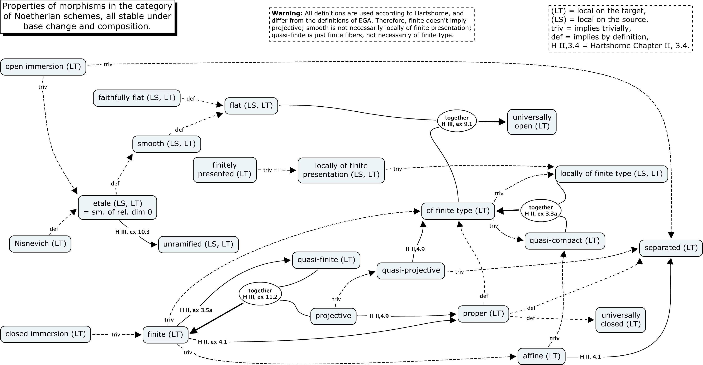

# Examples and Counterexamples in Elementary Algebraic Geometry

A curated collection of **concrete examples, counterexamples, constructions, and computations** in elementary algebraic geometry.

## About

This project collects worked examples that complement standard textbooks (Hartshorne, Vakil, Stacks Project, etc.), giving learners concrete objects to work with when entering the field.

The collection covers:

- **Schemes & morphisms**: affineness, flatness, smoothness, etale maps, base change
- **Sheaves & bundles**: coherent sheaves, locally free sheaves, normal bundles
- **Curves**: genus, inflection points, automorphisms, Hasse principle violations
- **Cohomology**: local duality, Borel-Moore homology, derived categories, Fourier-Mukai transforms
- **Computations**: Picard/class groups, intersection theory, Hodge theory, weight filtrations
- **Moduli & deformation**: stability, moduli stacks, $\operatorname{Pic}(\mathscr{M}_{1,1})$, deformation of sheaves

## ECAG-Bench

**ECAG-Bench** is an LLM benchmark derived from this collection, testing whether language models can construct concrete algebraic geometry examples satisfying given properties.

## Contributing

We welcome contributions! See [CONTRIBUTING.md](https://github.com/Waerden001/Examples_and_Counterexamples_in_Elementary_Algebraic_Geometry/blob/master/CONTRIBUTING.md) for guidelines. Examples marked as **Stub** are open for community contributions.

## License

[CC BY 4.0](https://creativecommons.org/licenses/by/4.0/) — Shuai Wang, 2018-2026.
